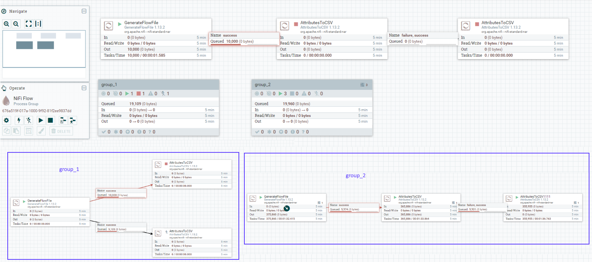

## NiFi Promethues Exporter

This is a springboot app that crawls and exports NiFi's cluster health and processor metrics. 

### Required Configuration

update src/resource/application.properties to configure
```
server.port=56000
exporter.address=nifi-metrics
nifi.url=http://localhost:8080
nifi.username=
nifi.password=
nifi.kerberos.keytab=
nifi.kerberos.principal=
crawl.interval.ms=1000
```

### Implemented Exporter
#### Nifi Cluster Health
| exporter name | description |
| :--- | :--- |
| nifi_connected_node_count | number of node connected|
| nifi_cluster_space_utilization | percentage of the storage space used |
| nifi_cluster_free_space | usable space (byte) available for use by the underlying storage mechanism|
| nifi_cluster_live_thread | number of live threads in the Java virtual machine (both daemon and non-daemon threads|
| nifi_cluster_heap_utilization | percentage of the heap utilized |
| nifi_cluster_free_heap | amount of free memory (byte) in the heap that can be used by the Java virtual machine|


#### Flow Path Metrics
each exported flow path metric belongs to a flow in NiFi; from a starting processor to ending processor. with 0 to many processors in between

| exporter name | description |
| :--- | :--- |
| nifi_flow_file_metrics | number of flow file in and out / byte over 5min |
| nifi_flow_congestion | max congestion rate in a chain of processors |
| nifi_flow_running_state | running state of a flow path |
| nifi_flow_latency | measure of latency in a chain of processors in millisec |

##### Labels
each flow path metrics has the following labels tagged to indicate its flow path

| exporter name | description |
| :--- | :--- |
| process_group | group name of the end processor |
| process_group_id | group id of the end processor |
| processor_path | location of the end processor |
| starting_process | name of start processor |
| starting_process_id | id of start processor |
| processor_name | name of end processor |
| id | id of end processor |
| type | metrics type; BytesRead, BytesWritten, FlowFilesIn or FlowFilesOut |


### Example NiFi Flow and Output



```
root: GenerateFlowFile -> AttributesToCSV -> AttributesToCSV
root/group_1: GenerateFlowFile -> AttributesToCSV
root/group_1: GenerateFlowFile -> AttributesToCSV
root/group_2: GenerateFlowFile -> AttributesToCSV -> AttributesToCSV
```
  

```
# HELP nifi_cluster_heap_utilization percentage of the heap used
# TYPE nifi_cluster_heap_utilization gauge
nifi_cluster_heap_utilization 38.0
# HELP nifi_flow_latency measure of latency in a chain of processors in millisec
# TYPE nifi_flow_latency gauge
nifi_flow_latency{process_group="group_2",process_group_id="017a1000-4136-179d-3f2d-3471e86dca84",processor_path="/group_2/AttributesToCSV",processor_type="AttributesToCSV",starting_process="GenerateFlowFile",starting_process_id="017a1003-4136-179d-f810-38f7667029df",starting_process_type="GenerateFlowFile",processor_name="AttributesToCSV",id="017a1001-4136-179d-50e8-60bb3a56c748",} 2812.0
nifi_flow_latency{process_group="group_2",process_group_id="017a1000-4136-179d-3f2d-3471e86dca84",processor_path="/group_2/GenerateFlowFile",processor_type="GenerateFlowFile",starting_process="GenerateFlowFile",starting_process_id="017a1003-4136-179d-f810-38f7667029df",starting_process_type="GenerateFlowFile",processor_name="GenerateFlowFile",id="017a1003-4136-179d-f810-38f7667029df",} 0.0
nifi_flow_latency{process_group="root",process_group_id="676a519f-017a-1000-9f92-81f2ee9837dd",processor_path="/AttributesToCSV",processor_type="AttributesToCSV",starting_process="GenerateFlowFile",starting_process_id="677bd3d1-017a-1000-425c-ee20ef4c7f3a",starting_process_type="GenerateFlowFile",processor_name="AttributesToCSV",id="677bf8ac-017a-1000-5e78-13a843753863",} 0.0
nifi_flow_latency{process_group="group_1",process_group_id="679d4136-017a-1000-2e1a-14118d715b1d",processor_path="/group_1/AttributesToCSV",processor_type="AttributesToCSV",starting_process="GenerateFlowFile",starting_process_id="017a1000-d3d1-177b-35ca-a370baed73ea",starting_process_type="GenerateFlowFile",processor_name="AttributesToCSV",id="017a1003-f8ac-177b-8fa6-25d989c3f3c0",} 0.0
nifi_flow_latency{process_group="root",process_group_id="676a519f-017a-1000-9f92-81f2ee9837dd",processor_path="/GenerateFlowFile",processor_type="GenerateFlowFile",starting_process="GenerateFlowFile",starting_process_id="677bd3d1-017a-1000-425c-ee20ef4c7f3a",starting_process_type="GenerateFlowFile",processor_name="GenerateFlowFile",id="677bd3d1-017a-1000-425c-ee20ef4c7f3a",} 0.0
nifi_flow_latency{process_group="group_1",process_group_id="679d4136-017a-1000-2e1a-14118d715b1d",processor_path="/group_1/AttributesToCSV",processor_type="AttributesToCSV",starting_process="GenerateFlowFile",starting_process_id="017a1000-d3d1-177b-35ca-a370baed73ea",starting_process_type="GenerateFlowFile",processor_name="AttributesToCSV",id="017a1000-f8ac-177b-e7bf-02b2e0467bc2",} 0.0
nifi_flow_latency{process_group="group_2",process_group_id="017a1000-4136-179d-3f2d-3471e86dca84",processor_path="/group_2/AttributesToCSV1111",processor_type="AttributesToCSV",starting_process="GenerateFlowFile",starting_process_id="017a1003-4136-179d-f810-38f7667029df",starting_process_type="GenerateFlowFile",processor_name="AttributesToCSV1111",id="017a1004-4136-179d-fe38-6faa1809d9dc",} 5778.0
nifi_flow_latency{process_group="root",process_group_id="676a519f-017a-1000-9f92-81f2ee9837dd",processor_path="/AttributesToCSV",processor_type="AttributesToCSV",starting_process="GenerateFlowFile",starting_process_id="677bd3d1-017a-1000-425c-ee20ef4c7f3a",starting_process_type="GenerateFlowFile",processor_name="AttributesToCSV",id="017a1009-4136-179d-0a73-d58686376de1",} 0.0
nifi_flow_latency{process_group="group_1",process_group_id="679d4136-017a-1000-2e1a-14118d715b1d",processor_path="/group_1/GenerateFlowFile",processor_type="GenerateFlowFile",starting_process="GenerateFlowFile",starting_process_id="017a1000-d3d1-177b-35ca-a370baed73ea",starting_process_type="GenerateFlowFile",processor_name="GenerateFlowFile",id="017a1000-d3d1-177b-35ca-a370baed73ea",} 0.0
# HELP nifi_cluster_free_heap The amount of free memory (byte) in the heap that can be used by the Java virtual machine.
# TYPE nifi_cluster_free_heap gauge
nifi_cluster_free_heap 3.1860784E8
# HELP nifi_cluster_free_space The usable space (byte) available for use by the underlying storage mechanism
# TYPE nifi_cluster_free_space gauge
nifi_cluster_free_space 2.3726829568E11
# HELP nifi_flow_congestion max congestion rate in a chain of processors
# TYPE nifi_flow_congestion gauge
nifi_flow_congestion{process_group="group_2",process_group_id="017a1000-4136-179d-3f2d-3471e86dca84",processor_path="/group_2/AttributesToCSV",processor_type="AttributesToCSV",starting_process="GenerateFlowFile",starting_process_id="017a1003-4136-179d-f810-38f7667029df",starting_process_type="GenerateFlowFile",processor_name="AttributesToCSV",id="017a1001-4136-179d-50e8-60bb3a56c748",} 100.0
nifi_flow_congestion{process_group="group_2",process_group_id="017a1000-4136-179d-3f2d-3471e86dca84",processor_path="/group_2/GenerateFlowFile",processor_type="GenerateFlowFile",starting_process="GenerateFlowFile",starting_process_id="017a1003-4136-179d-f810-38f7667029df",starting_process_type="GenerateFlowFile",processor_name="GenerateFlowFile",id="017a1003-4136-179d-f810-38f7667029df",} 0.0
nifi_flow_congestion{process_group="root",process_group_id="676a519f-017a-1000-9f92-81f2ee9837dd",processor_path="/AttributesToCSV",processor_type="AttributesToCSV",starting_process="GenerateFlowFile",starting_process_id="677bd3d1-017a-1000-425c-ee20ef4c7f3a",starting_process_type="GenerateFlowFile",processor_name="AttributesToCSV",id="677bf8ac-017a-1000-5e78-13a843753863",} 100.0
nifi_flow_congestion{process_group="group_1",process_group_id="679d4136-017a-1000-2e1a-14118d715b1d",processor_path="/group_1/AttributesToCSV",processor_type="AttributesToCSV",starting_process="GenerateFlowFile",starting_process_id="017a1000-d3d1-177b-35ca-a370baed73ea",starting_process_type="GenerateFlowFile",processor_name="AttributesToCSV",id="017a1003-f8ac-177b-8fa6-25d989c3f3c0",} 91.0
nifi_flow_congestion{process_group="root",process_group_id="676a519f-017a-1000-9f92-81f2ee9837dd",processor_path="/GenerateFlowFile",processor_type="GenerateFlowFile",starting_process="GenerateFlowFile",starting_process_id="677bd3d1-017a-1000-425c-ee20ef4c7f3a",starting_process_type="GenerateFlowFile",processor_name="GenerateFlowFile",id="677bd3d1-017a-1000-425c-ee20ef4c7f3a",} 0.0
nifi_flow_congestion{process_group="group_1",process_group_id="679d4136-017a-1000-2e1a-14118d715b1d",processor_path="/group_1/AttributesToCSV",processor_type="AttributesToCSV",starting_process="GenerateFlowFile",starting_process_id="017a1000-d3d1-177b-35ca-a370baed73ea",starting_process_type="GenerateFlowFile",processor_name="AttributesToCSV",id="017a1000-f8ac-177b-e7bf-02b2e0467bc2",} 100.0
nifi_flow_congestion{process_group="group_2",process_group_id="017a1000-4136-179d-3f2d-3471e86dca84",processor_path="/group_2/AttributesToCSV1111",processor_type="AttributesToCSV",starting_process="GenerateFlowFile",starting_process_id="017a1003-4136-179d-f810-38f7667029df",starting_process_type="GenerateFlowFile",processor_name="AttributesToCSV1111",id="017a1004-4136-179d-fe38-6faa1809d9dc",} 100.0
nifi_flow_congestion{process_group="root",process_group_id="676a519f-017a-1000-9f92-81f2ee9837dd",processor_path="/AttributesToCSV",processor_type="AttributesToCSV",starting_process="GenerateFlowFile",starting_process_id="677bd3d1-017a-1000-425c-ee20ef4c7f3a",starting_process_type="GenerateFlowFile",processor_name="AttributesToCSV",id="017a1009-4136-179d-0a73-d58686376de1",} 100.0
nifi_flow_congestion{process_group="group_1",process_group_id="679d4136-017a-1000-2e1a-14118d715b1d",processor_path="/group_1/GenerateFlowFile",processor_type="GenerateFlowFile",starting_process="GenerateFlowFile",starting_process_id="017a1000-d3d1-177b-35ca-a370baed73ea",starting_process_type="GenerateFlowFile",processor_name="GenerateFlowFile",id="017a1000-d3d1-177b-35ca-a370baed73ea",} 0.0
# HELP nifi_connected_node_count number of node connected
# TYPE nifi_connected_node_count gauge
nifi_connected_node_count 1.0
# HELP nifi_flow_running_state running state of a flow path
# TYPE nifi_flow_running_state gauge
nifi_flow_running_state{process_group="group_2",process_group_id="017a1000-4136-179d-3f2d-3471e86dca84",processor_path="/group_2/AttributesToCSV",processor_type="AttributesToCSV",starting_process="GenerateFlowFile",starting_process_id="017a1003-4136-179d-f810-38f7667029df",starting_process_type="GenerateFlowFile",processor_name="AttributesToCSV",id="017a1001-4136-179d-50e8-60bb3a56c748",} 1.0
nifi_flow_running_state{process_group="group_2",process_group_id="017a1000-4136-179d-3f2d-3471e86dca84",processor_path="/group_2/GenerateFlowFile",processor_type="GenerateFlowFile",starting_process="GenerateFlowFile",starting_process_id="017a1003-4136-179d-f810-38f7667029df",starting_process_type="GenerateFlowFile",processor_name="GenerateFlowFile",id="017a1003-4136-179d-f810-38f7667029df",} 1.0
nifi_flow_running_state{process_group="root",process_group_id="676a519f-017a-1000-9f92-81f2ee9837dd",processor_path="/AttributesToCSV",processor_type="AttributesToCSV",starting_process="GenerateFlowFile",starting_process_id="677bd3d1-017a-1000-425c-ee20ef4c7f3a",starting_process_type="GenerateFlowFile",processor_name="AttributesToCSV",id="677bf8ac-017a-1000-5e78-13a843753863",} 0.0
nifi_flow_running_state{process_group="group_1",process_group_id="679d4136-017a-1000-2e1a-14118d715b1d",processor_path="/group_1/AttributesToCSV",processor_type="AttributesToCSV",starting_process="GenerateFlowFile",starting_process_id="017a1000-d3d1-177b-35ca-a370baed73ea",starting_process_type="GenerateFlowFile",processor_name="AttributesToCSV",id="017a1003-f8ac-177b-8fa6-25d989c3f3c0",} 0.0
nifi_flow_running_state{process_group="root",process_group_id="676a519f-017a-1000-9f92-81f2ee9837dd",processor_path="/GenerateFlowFile",processor_type="GenerateFlowFile",starting_process="GenerateFlowFile",starting_process_id="677bd3d1-017a-1000-425c-ee20ef4c7f3a",starting_process_type="GenerateFlowFile",processor_name="GenerateFlowFile",id="677bd3d1-017a-1000-425c-ee20ef4c7f3a",} 1.0
nifi_flow_running_state{process_group="group_1",process_group_id="679d4136-017a-1000-2e1a-14118d715b1d",processor_path="/group_1/AttributesToCSV",processor_type="AttributesToCSV",starting_process="GenerateFlowFile",starting_process_id="017a1000-d3d1-177b-35ca-a370baed73ea",starting_process_type="GenerateFlowFile",processor_name="AttributesToCSV",id="017a1000-f8ac-177b-e7bf-02b2e0467bc2",} 0.0
nifi_flow_running_state{process_group="group_2",process_group_id="017a1000-4136-179d-3f2d-3471e86dca84",processor_path="/group_2/AttributesToCSV1111",processor_type="AttributesToCSV",starting_process="GenerateFlowFile",starting_process_id="017a1003-4136-179d-f810-38f7667029df",starting_process_type="GenerateFlowFile",processor_name="AttributesToCSV1111",id="017a1004-4136-179d-fe38-6faa1809d9dc",} 1.0
nifi_flow_running_state{process_group="root",process_group_id="676a519f-017a-1000-9f92-81f2ee9837dd",processor_path="/AttributesToCSV",processor_type="AttributesToCSV",starting_process="GenerateFlowFile",starting_process_id="677bd3d1-017a-1000-425c-ee20ef4c7f3a",starting_process_type="GenerateFlowFile",processor_name="AttributesToCSV",id="017a1009-4136-179d-0a73-d58686376de1",} 0.0
nifi_flow_running_state{process_group="group_1",process_group_id="679d4136-017a-1000-2e1a-14118d715b1d",processor_path="/group_1/GenerateFlowFile",processor_type="GenerateFlowFile",starting_process="GenerateFlowFile",starting_process_id="017a1000-d3d1-177b-35ca-a370baed73ea",starting_process_type="GenerateFlowFile",processor_name="GenerateFlowFile",id="017a1000-d3d1-177b-35ca-a370baed73ea",} 1.0
# HELP nifi_cluster_space_utilization percentage of the storage space used
# TYPE nifi_cluster_space_utilization gauge
nifi_cluster_space_utilization 0.0
# HELP nifi_cluster_live_thread The current number of live threads in the Java virtual machine (both daemon and non-daemon threads).
# TYPE nifi_cluster_live_thread gauge
nifi_cluster_live_thread 78.0
# HELP nifi_flow_file_metrics number of flowfile in and out / byte over 5min
# TYPE nifi_flow_file_metrics gauge
nifi_flow_file_metrics{process_group="group_2",process_group_id="017a1000-4136-179d-3f2d-3471e86dca84",processor_path="/group_2/GenerateFlowFile",processor_type="GenerateFlowFile",starting_process="GenerateFlowFile",starting_process_id="017a1003-4136-179d-f810-38f7667029df",starting_process_type="GenerateFlowFile",processor_name="GenerateFlowFile",id="017a1003-4136-179d-f810-38f7667029df",type="BytesRead",} 0.0
nifi_flow_file_metrics{process_group="group_2",process_group_id="017a1000-4136-179d-3f2d-3471e86dca84",processor_path="/group_2/AttributesToCSV1111",processor_type="AttributesToCSV",starting_process="GenerateFlowFile",starting_process_id="017a1003-4136-179d-f810-38f7667029df",starting_process_type="GenerateFlowFile",processor_name="AttributesToCSV1111",id="017a1004-4136-179d-fe38-6faa1809d9dc",type="BytesWritten",} 0.0
nifi_flow_file_metrics{process_group="root",process_group_id="676a519f-017a-1000-9f92-81f2ee9837dd",processor_path="/GenerateFlowFile",processor_type="GenerateFlowFile",starting_process="GenerateFlowFile",starting_process_id="677bd3d1-017a-1000-425c-ee20ef4c7f3a",starting_process_type="GenerateFlowFile",processor_name="GenerateFlowFile",id="677bd3d1-017a-1000-425c-ee20ef4c7f3a",type="FlowFilesIn",} 0.0
nifi_flow_file_metrics{process_group="group_1",process_group_id="679d4136-017a-1000-2e1a-14118d715b1d",processor_path="/group_1/GenerateFlowFile",processor_type="GenerateFlowFile",starting_process="GenerateFlowFile",starting_process_id="017a1000-d3d1-177b-35ca-a370baed73ea",starting_process_type="GenerateFlowFile",processor_name="GenerateFlowFile",id="017a1000-d3d1-177b-35ca-a370baed73ea",type="BytesWritten",} 0.0
nifi_flow_file_metrics{process_group="group_1",process_group_id="679d4136-017a-1000-2e1a-14118d715b1d",processor_path="/group_1/GenerateFlowFile",processor_type="GenerateFlowFile",starting_process="GenerateFlowFile",starting_process_id="017a1000-d3d1-177b-35ca-a370baed73ea",starting_process_type="GenerateFlowFile",processor_name="GenerateFlowFile",id="017a1000-d3d1-177b-35ca-a370baed73ea",type="FlowFilesIn",} 0.0
nifi_flow_file_metrics{process_group="root",process_group_id="676a519f-017a-1000-9f92-81f2ee9837dd",processor_path="/AttributesToCSV",processor_type="AttributesToCSV",starting_process="GenerateFlowFile",starting_process_id="677bd3d1-017a-1000-425c-ee20ef4c7f3a",starting_process_type="GenerateFlowFile",processor_name="AttributesToCSV",id="677bf8ac-017a-1000-5e78-13a843753863",type="FlowFilesOut",} 0.0
nifi_flow_file_metrics{process_group="group_2",process_group_id="017a1000-4136-179d-3f2d-3471e86dca84",processor_path="/group_2/AttributesToCSV1111",processor_type="AttributesToCSV",starting_process="GenerateFlowFile",starting_process_id="017a1003-4136-179d-f810-38f7667029df",starting_process_type="GenerateFlowFile",processor_name="AttributesToCSV1111",id="017a1004-4136-179d-fe38-6faa1809d9dc",type="FlowFilesIn",} 610069.0
nifi_flow_file_metrics{process_group="root",process_group_id="676a519f-017a-1000-9f92-81f2ee9837dd",processor_path="/GenerateFlowFile",processor_type="GenerateFlowFile",starting_process="GenerateFlowFile",starting_process_id="677bd3d1-017a-1000-425c-ee20ef4c7f3a",starting_process_type="GenerateFlowFile",processor_name="GenerateFlowFile",id="677bd3d1-017a-1000-425c-ee20ef4c7f3a",type="BytesWritten",} 0.0
nifi_flow_file_metrics{process_group="group_2",process_group_id="017a1000-4136-179d-3f2d-3471e86dca84",processor_path="/group_2/GenerateFlowFile",processor_type="GenerateFlowFile",starting_process="GenerateFlowFile",starting_process_id="017a1003-4136-179d-f810-38f7667029df",starting_process_type="GenerateFlowFile",processor_name="GenerateFlowFile",id="017a1003-4136-179d-f810-38f7667029df",type="FlowFilesOut",} 629969.0
nifi_flow_file_metrics{process_group="group_1",process_group_id="679d4136-017a-1000-2e1a-14118d715b1d",processor_path="/group_1/GenerateFlowFile",processor_type="GenerateFlowFile",starting_process="GenerateFlowFile",starting_process_id="017a1000-d3d1-177b-35ca-a370baed73ea",starting_process_type="GenerateFlowFile",processor_name="GenerateFlowFile",id="017a1000-d3d1-177b-35ca-a370baed73ea",type="FlowFilesOut",} 0.0
nifi_flow_file_metrics{process_group="group_1",process_group_id="679d4136-017a-1000-2e1a-14118d715b1d",processor_path="/group_1/AttributesToCSV",processor_type="AttributesToCSV",starting_process="GenerateFlowFile",starting_process_id="017a1000-d3d1-177b-35ca-a370baed73ea",starting_process_type="GenerateFlowFile",processor_name="AttributesToCSV",id="017a1003-f8ac-177b-8fa6-25d989c3f3c0",type="FlowFilesIn",} 0.0
nifi_flow_file_metrics{process_group="root",process_group_id="676a519f-017a-1000-9f92-81f2ee9837dd",processor_path="/AttributesToCSV",processor_type="AttributesToCSV",starting_process="GenerateFlowFile",starting_process_id="677bd3d1-017a-1000-425c-ee20ef4c7f3a",starting_process_type="GenerateFlowFile",processor_name="AttributesToCSV",id="017a1009-4136-179d-0a73-d58686376de1",type="BytesRead",} 0.0
nifi_flow_file_metrics{process_group="root",process_group_id="676a519f-017a-1000-9f92-81f2ee9837dd",processor_path="/AttributesToCSV",processor_type="AttributesToCSV",starting_process="GenerateFlowFile",starting_process_id="677bd3d1-017a-1000-425c-ee20ef4c7f3a",starting_process_type="GenerateFlowFile",processor_name="AttributesToCSV",id="677bf8ac-017a-1000-5e78-13a843753863",type="BytesRead",} 0.0
nifi_flow_file_metrics{process_group="group_2",process_group_id="017a1000-4136-179d-3f2d-3471e86dca84",processor_path="/group_2/AttributesToCSV1111",processor_type="AttributesToCSV",starting_process="GenerateFlowFile",starting_process_id="017a1003-4136-179d-f810-38f7667029df",starting_process_type="GenerateFlowFile",processor_name="AttributesToCSV1111",id="017a1004-4136-179d-fe38-6faa1809d9dc",type="FlowFilesOut",} 0.0
nifi_flow_file_metrics{process_group="group_2",process_group_id="017a1000-4136-179d-3f2d-3471e86dca84",processor_path="/group_2/AttributesToCSV1111",processor_type="AttributesToCSV",starting_process="GenerateFlowFile",starting_process_id="017a1003-4136-179d-f810-38f7667029df",starting_process_type="GenerateFlowFile",processor_name="AttributesToCSV1111",id="017a1004-4136-179d-fe38-6faa1809d9dc",type="BytesRead",} 0.0
nifi_flow_file_metrics{process_group="group_1",process_group_id="679d4136-017a-1000-2e1a-14118d715b1d",processor_path="/group_1/AttributesToCSV",processor_type="AttributesToCSV",starting_process="GenerateFlowFile",starting_process_id="017a1000-d3d1-177b-35ca-a370baed73ea",starting_process_type="GenerateFlowFile",processor_name="AttributesToCSV",id="017a1003-f8ac-177b-8fa6-25d989c3f3c0",type="BytesWritten",} 0.0
nifi_flow_file_metrics{process_group="group_2",process_group_id="017a1000-4136-179d-3f2d-3471e86dca84",processor_path="/group_2/AttributesToCSV",processor_type="AttributesToCSV",starting_process="GenerateFlowFile",starting_process_id="017a1003-4136-179d-f810-38f7667029df",starting_process_type="GenerateFlowFile",processor_name="AttributesToCSV",id="017a1001-4136-179d-50e8-60bb3a56c748",type="BytesWritten",} 0.0
nifi_flow_file_metrics{process_group="group_1",process_group_id="679d4136-017a-1000-2e1a-14118d715b1d",processor_path="/group_1/AttributesToCSV",processor_type="AttributesToCSV",starting_process="GenerateFlowFile",starting_process_id="017a1000-d3d1-177b-35ca-a370baed73ea",starting_process_type="GenerateFlowFile",processor_name="AttributesToCSV",id="017a1000-f8ac-177b-e7bf-02b2e0467bc2",type="FlowFilesIn",} 0.0
nifi_flow_file_metrics{process_group="group_1",process_group_id="679d4136-017a-1000-2e1a-14118d715b1d",processor_path="/group_1/AttributesToCSV",processor_type="AttributesToCSV",starting_process="GenerateFlowFile",starting_process_id="017a1000-d3d1-177b-35ca-a370baed73ea",starting_process_type="GenerateFlowFile",processor_name="AttributesToCSV",id="017a1000-f8ac-177b-e7bf-02b2e0467bc2",type="BytesWritten",} 0.0
nifi_flow_file_metrics{process_group="root",process_group_id="676a519f-017a-1000-9f92-81f2ee9837dd",processor_path="/GenerateFlowFile",processor_type="GenerateFlowFile",starting_process="GenerateFlowFile",starting_process_id="677bd3d1-017a-1000-425c-ee20ef4c7f3a",starting_process_type="GenerateFlowFile",processor_name="GenerateFlowFile",id="677bd3d1-017a-1000-425c-ee20ef4c7f3a",type="BytesRead",} 0.0
nifi_flow_file_metrics{process_group="root",process_group_id="676a519f-017a-1000-9f92-81f2ee9837dd",processor_path="/AttributesToCSV",processor_type="AttributesToCSV",starting_process="GenerateFlowFile",starting_process_id="677bd3d1-017a-1000-425c-ee20ef4c7f3a",starting_process_type="GenerateFlowFile",processor_name="AttributesToCSV",id="017a1009-4136-179d-0a73-d58686376de1",type="FlowFilesIn",} 0.0
nifi_flow_file_metrics{process_group="root",process_group_id="676a519f-017a-1000-9f92-81f2ee9837dd",processor_path="/AttributesToCSV",processor_type="AttributesToCSV",starting_process="GenerateFlowFile",starting_process_id="677bd3d1-017a-1000-425c-ee20ef4c7f3a",starting_process_type="GenerateFlowFile",processor_name="AttributesToCSV",id="017a1009-4136-179d-0a73-d58686376de1",type="FlowFilesOut",} 0.0
nifi_flow_file_metrics{process_group="group_2",process_group_id="017a1000-4136-179d-3f2d-3471e86dca84",processor_path="/group_2/GenerateFlowFile",processor_type="GenerateFlowFile",starting_process="GenerateFlowFile",starting_process_id="017a1003-4136-179d-f810-38f7667029df",starting_process_type="GenerateFlowFile",processor_name="GenerateFlowFile",id="017a1003-4136-179d-f810-38f7667029df",type="FlowFilesIn",} 0.0
nifi_flow_file_metrics{process_group="root",process_group_id="676a519f-017a-1000-9f92-81f2ee9837dd",processor_path="/AttributesToCSV",processor_type="AttributesToCSV",starting_process="GenerateFlowFile",starting_process_id="677bd3d1-017a-1000-425c-ee20ef4c7f3a",starting_process_type="GenerateFlowFile",processor_name="AttributesToCSV",id="017a1009-4136-179d-0a73-d58686376de1",type="BytesWritten",} 0.0
nifi_flow_file_metrics{process_group="group_2",process_group_id="017a1000-4136-179d-3f2d-3471e86dca84",processor_path="/group_2/AttributesToCSV",processor_type="AttributesToCSV",starting_process="GenerateFlowFile",starting_process_id="017a1003-4136-179d-f810-38f7667029df",starting_process_type="GenerateFlowFile",processor_name="AttributesToCSV",id="017a1001-4136-179d-50e8-60bb3a56c748",type="FlowFilesOut",} 620009.0
nifi_flow_file_metrics{process_group="group_2",process_group_id="017a1000-4136-179d-3f2d-3471e86dca84",processor_path="/group_2/AttributesToCSV",processor_type="AttributesToCSV",starting_process="GenerateFlowFile",starting_process_id="017a1003-4136-179d-f810-38f7667029df",starting_process_type="GenerateFlowFile",processor_name="AttributesToCSV",id="017a1001-4136-179d-50e8-60bb3a56c748",type="FlowFilesIn",} 620009.0
nifi_flow_file_metrics{process_group="group_1",process_group_id="679d4136-017a-1000-2e1a-14118d715b1d",processor_path="/group_1/AttributesToCSV",processor_type="AttributesToCSV",starting_process="GenerateFlowFile",starting_process_id="017a1000-d3d1-177b-35ca-a370baed73ea",starting_process_type="GenerateFlowFile",processor_name="AttributesToCSV",id="017a1003-f8ac-177b-8fa6-25d989c3f3c0",type="FlowFilesOut",} 0.0
nifi_flow_file_metrics{process_group="root",process_group_id="676a519f-017a-1000-9f92-81f2ee9837dd",processor_path="/GenerateFlowFile",processor_type="GenerateFlowFile",starting_process="GenerateFlowFile",starting_process_id="677bd3d1-017a-1000-425c-ee20ef4c7f3a",starting_process_type="GenerateFlowFile",processor_name="GenerateFlowFile",id="677bd3d1-017a-1000-425c-ee20ef4c7f3a",type="FlowFilesOut",} 10000.0
nifi_flow_file_metrics{process_group="group_2",process_group_id="017a1000-4136-179d-3f2d-3471e86dca84",processor_path="/group_2/GenerateFlowFile",processor_type="GenerateFlowFile",starting_process="GenerateFlowFile",starting_process_id="017a1003-4136-179d-f810-38f7667029df",starting_process_type="GenerateFlowFile",processor_name="GenerateFlowFile",id="017a1003-4136-179d-f810-38f7667029df",type="BytesWritten",} 0.0
nifi_flow_file_metrics{process_group="group_1",process_group_id="679d4136-017a-1000-2e1a-14118d715b1d",processor_path="/group_1/AttributesToCSV",processor_type="AttributesToCSV",starting_process="GenerateFlowFile",starting_process_id="017a1000-d3d1-177b-35ca-a370baed73ea",starting_process_type="GenerateFlowFile",processor_name="AttributesToCSV",id="017a1000-f8ac-177b-e7bf-02b2e0467bc2",type="BytesRead",} 0.0
nifi_flow_file_metrics{process_group="root",process_group_id="676a519f-017a-1000-9f92-81f2ee9837dd",processor_path="/AttributesToCSV",processor_type="AttributesToCSV",starting_process="GenerateFlowFile",starting_process_id="677bd3d1-017a-1000-425c-ee20ef4c7f3a",starting_process_type="GenerateFlowFile",processor_name="AttributesToCSV",id="677bf8ac-017a-1000-5e78-13a843753863",type="FlowFilesIn",} 0.0
nifi_flow_file_metrics{process_group="root",process_group_id="676a519f-017a-1000-9f92-81f2ee9837dd",processor_path="/AttributesToCSV",processor_type="AttributesToCSV",starting_process="GenerateFlowFile",starting_process_id="677bd3d1-017a-1000-425c-ee20ef4c7f3a",starting_process_type="GenerateFlowFile",processor_name="AttributesToCSV",id="677bf8ac-017a-1000-5e78-13a843753863",type="BytesWritten",} 0.0
nifi_flow_file_metrics{process_group="group_1",process_group_id="679d4136-017a-1000-2e1a-14118d715b1d",processor_path="/group_1/AttributesToCSV",processor_type="AttributesToCSV",starting_process="GenerateFlowFile",starting_process_id="017a1000-d3d1-177b-35ca-a370baed73ea",starting_process_type="GenerateFlowFile",processor_name="AttributesToCSV",id="017a1000-f8ac-177b-e7bf-02b2e0467bc2",type="FlowFilesOut",} 0.0
nifi_flow_file_metrics{process_group="group_2",process_group_id="017a1000-4136-179d-3f2d-3471e86dca84",processor_path="/group_2/AttributesToCSV",processor_type="AttributesToCSV",starting_process="GenerateFlowFile",starting_process_id="017a1003-4136-179d-f810-38f7667029df",starting_process_type="GenerateFlowFile",processor_name="AttributesToCSV",id="017a1001-4136-179d-50e8-60bb3a56c748",type="BytesRead",} 0.0
nifi_flow_file_metrics{process_group="group_1",process_group_id="679d4136-017a-1000-2e1a-14118d715b1d",processor_path="/group_1/GenerateFlowFile",processor_type="GenerateFlowFile",starting_process="GenerateFlowFile",starting_process_id="017a1000-d3d1-177b-35ca-a370baed73ea",starting_process_type="GenerateFlowFile",processor_name="GenerateFlowFile",id="017a1000-d3d1-177b-35ca-a370baed73ea",type="BytesRead",} 0.0
nifi_flow_file_metrics{process_group="group_1",process_group_id="679d4136-017a-1000-2e1a-14118d715b1d",processor_path="/group_1/AttributesToCSV",processor_type="AttributesToCSV",starting_process="GenerateFlowFile",starting_process_id="017a1000-d3d1-177b-35ca-a370baed73ea",starting_process_type="GenerateFlowFile",processor_name="AttributesToCSV",id="017a1003-f8ac-177b-8fa6-25d989c3f3c0",type="BytesRead",} 0.0

```